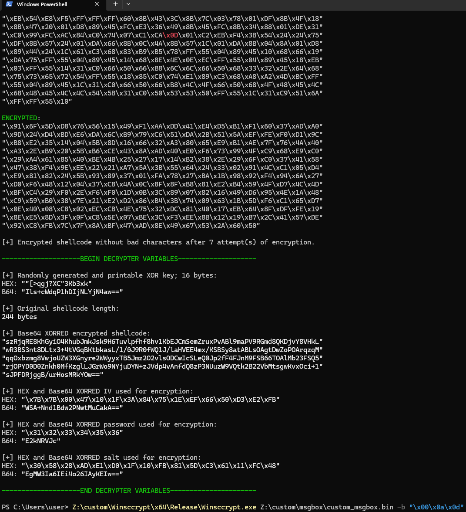

# Windows Shellcode Encryptor

Winsccrypt is a C program designed to encrypt shellcode, checking bad characters in payloads that could interfere with execution. It uses AES-256 encryption and incorporates XOR and Base64 encoding. This program is used for obfuscating shellcode to evade detection or modification during transmission or storage.

You will need to enter the output variables in a decrypter program for the payload to run (decrypter is work-in-progress).

**Sample output**



## Features

  * AES-256-CBC Encryption: Encrypts shellcode based on entered password. Creates a random salt and IV.
  * Bad Character Detection: Detects and avoids specified "bad characters" in the encrypted data.
  * XOR and Base64 Encoding: Further obfuscates the encrypted shellcode using XOR encryption and Base64 encoding.

## Dependencies

  * OpenSSL dev libraries: Used for AES encryption and Base64 encoding.
  * Vcpkg: to integrate with Visual Studio and download OpenSSL dev libs (or just with cl.exe, see below).
  * Windows System Libraries: For secure input and cryptographic operations (user32.lib, advapi32.lib, crypt32.lib, ws2_32.lib).

To compile this program, you will need the OpenSSL libraries linked and available in your development environment.
Correctly update the path to the OpenSSL development libraries, as it currently assumes ```c:\tools\vcpkg```.

## Usage
**Basic Usage**

The program takes a shellcode file as an argument, followed by an optional -b flag to specify any bad characters that should be avoided in the encrypted output.

```winsccrypt.exe my_shellcode.bin -b "\x00\x0A\x0D"```

**Output**

The program outputs several details, including:

  * Original shellcode: The shellcode as it was read from the input file.
  * Encrypted shellcode: The AES-encrypted shellcode, displayed in hex format with bad characters highlighted in red.
  * XOR Key: A random key used to XOR the encrypted data.
  * Base64 Encoded Data: The encrypted shellcode, key, IV, salt, and password, all encoded in Base64 for easy transmission or storage.

## Compiling without VS Studio/Code

Correctly update the path to the static OpenSSL development libraries.

**Encrypter x86 on Windows**

```cl -MT -I C:\tools\vcpkg\packages\openssl_x86-windows-static\include Winsccrypt/Winsccrypt.c /link /LIBPATH:C:\tools\vcpkg\packages\openssl_x86-windows-static\lib libssl.lib libcrypto.lib /OPT:REF /OPT:ICF /RELEASE /PDB:none /NOLOGO```

**Encrypter x64 on Windows**

```cl -MT -I C:\tools\vcpkg\packages\openssl_x64-windows-static\include Winsccrypt/Winsccrypt.c /link /LIBPATH:C:\tools\vcpkg\packages\openssl_x64-windows-static\lib libssl.lib libcrypto.lib /OPT:REF /OPT:ICF /RELEASE /PDB:none /NOLOGO```