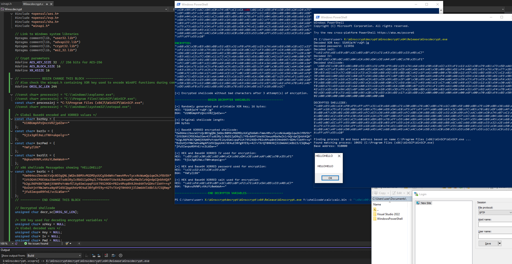

# Windows Shellcode Decryptor

Winscdecrypt is a C program designed to decrypt and run encrypted shellcode. It uses AES-256 encryption and incorporates XOR and Base64 encoding. This program is used for obfuscating shellcode to evade detection or modification during transmission or storage.

You will need to enter the encrypted variables as generated by the encrypter, as shown below.

**Sample output**



## Features

  * AES-256-CBC Encryption: Encrypts shellcode based on entered password. Creates a random salt and IV.
  * XOR and Base64 Encoding: Further obfuscates the encrypted shellcode using XOR encryption and Base64 encoding.

## Dependencies

  * OpenSSL dev libraries: Used for AES encryption and Base64 encoding.
  * Vcpkg: to integrate with Visual Studio and download OpenSSL dev libs (or just with cl.exe, see below).
  * Windows System Libraries: For secure input and cryptographic operations (user32.lib, advapi32.lib, crypt32.lib, ws2_32.lib).

To compile this program, you will need the OpenSSL libraries linked and available in your development environment.
Correctly update the path to the OpenSSL development libraries, as it currently assumes ```c:\tools\vcpkg```.

## Install VCPKG

**Download and setup vcpkg**

```mkdir c:\tools;cd c:\tools```

```git clone https://github.com/microsoft/vcpkg.git```

```cd vcpkg```

```bootstrap-vcpkg.bat```

```vcpkg integrate install```

**Install openssl static libs**

```vcpkg install openssl:x64-windows-static```

```vcpkg install openssl:x86-windows-static```

## Usage
**Basic Usage**

The program takes a shellcode file as an argument. The processname is hardcoded in the code (needs improvement).

```winscdecrypt.exe```

## Compiling without VS Studio/Code

Correctly update the path to the static OpenSSL development libraries.

**Encrypter x86 on Windows**

```cl -MT -I C:\tools\vcpkg\packages\openssl_x86-windows-static\include Winscdecrypt/Winscdecrypt.c /link /LIBPATH:C:\tools\vcpkg\packages\openssl_x86-windows-static\lib libssl.lib libcrypto.lib /OPT:REF /OPT:ICF /RELEASE /PDB:none /NOLOGO```

**Encrypter x64 on Windows**

```cl -MT -I C:\tools\vcpkg\packages\openssl_x64-windows-static\include Winscdecrypt/Winscdecrypt.c /link /LIBPATH:C:\tools\vcpkg\packages\openssl_x64-windows-static\lib libssl.lib libcrypto.lib /OPT:REF /OPT:ICF /RELEASE /PDB:none /NOLOGO```